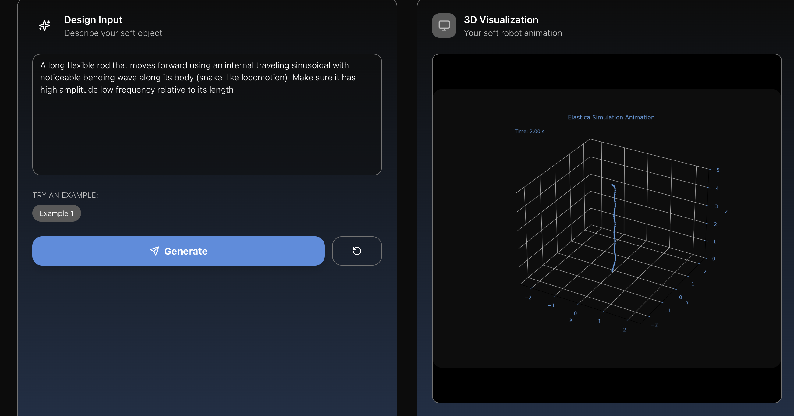

# Squishy.ai, a Text-to-Physics Soft Robotics Simulation Platform

## Overview

This project is a high-fidelity soft robotics simulation platform that leverages **Generative AI** to translate natural language descriptions into executable physics simulations. The system utilizes **PyElastica**, a Cosserat rod theory-based physics engine, to model complex continuum mechanics and soft body dynamics.

The application is architected as a monorepo containing a **FastAPI** backend for simulation orchestration and a **React/Vite** frontend for the interactive workshop environment.

We extend our thanks to [Keywords.ai]((https://www.keywordsai.co/)), [Trae](trae.ai), and [Lovable]((https://lovable.dev/)) for sponsoring credits for this project. We used Keywords to log our LLM requests and utilize the gateway to route the user request to the appropriate LLM based on the specific, grounded reasoning we needed. Trae powered our backend coding and Lovable our frontend.


## System Architecture

### Backend (`/backend`)
- **Framework**: FastAPI (Python 3.11+)
- **Physics Engine**: [PyElastica](https://github.com/GazzolaLab/PyElastica) (Cosserat Rod Theory)
- **JIT Compilation**: Numba (LLVM-based JIT for high-performance numerical computing)
- **Visualization**: Matplotlib (headless rendering) + FFmpeg (GIF encoding)
- **Orchestration**: BackgroundTasks for non-blocking simulation execution.

### Frontend (`/frontend`)
- **Framework**: React 18 + Vite
- **UI Library**: Shadcn UI + Tailwind CSS
- **State Management**: React Hooks
- **Communication**: REST API via Vite Proxy (dev) and Vercel Rewrites (prod).

## Prerequisites

Ensure the following system dependencies are installed:

- **Python 3.11+** (Required for PyElastica/Numba compatibility)
- **Node.js 18+** & **npm** (or Bun/Yarn)
- **FFmpeg**: Critical for rendering simulation GIFs.
  - macOS: `brew install ffmpeg`
  - Ubuntu: `sudo apt install ffmpeg`
  - Windows: `choco install ffmpeg`

## Installation & Setup

### 1. Clone Repository
```bash
git clone <repository-url>
cd squishy
```

### 2. Backend Setup
The backend requires a virtual environment to manage dependencies, particularly for Numba and PyElastica compilation.

```bash
cd backend
python -m venv venv
source venv/bin/activate  # On Windows: venv\Scripts\activate

# Install dependencies
# Note: numba>=0.60.0 is pinned to ensure LLVM compatibility
pip install -r requirements.txt
```

**Configuration:**
Create a `.env` file in `backend/` if environment variables (like OpenAI API keys) are required for the generative workflow.

### 3. Frontend Setup
```bash
cd ../frontend
npm install
# or if using bun
# bun install
```

## Running Locally

To run the full stack locally, you need to start both the backend server and the frontend development server concurrently.

### Terminal 1: Backend
```bash
cd backend
source venv/bin/activate
# Runs on http://localhost:8000
python server.py
```

### Terminal 2: Frontend
```bash
cd frontend
# Runs on http://localhost:8080 (proxies /api requests to localhost:8000)
npm run dev
```

Access the application at **http://localhost:8080**.

